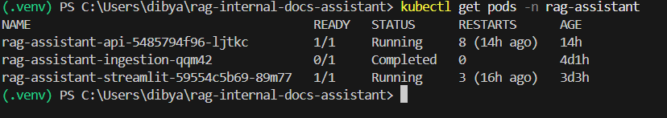
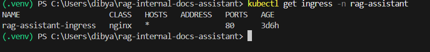
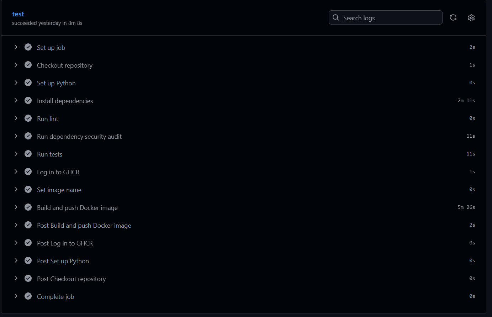
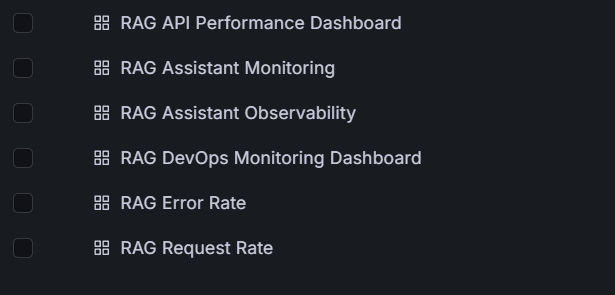
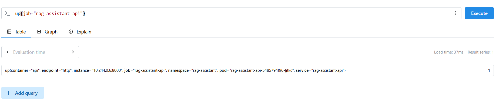
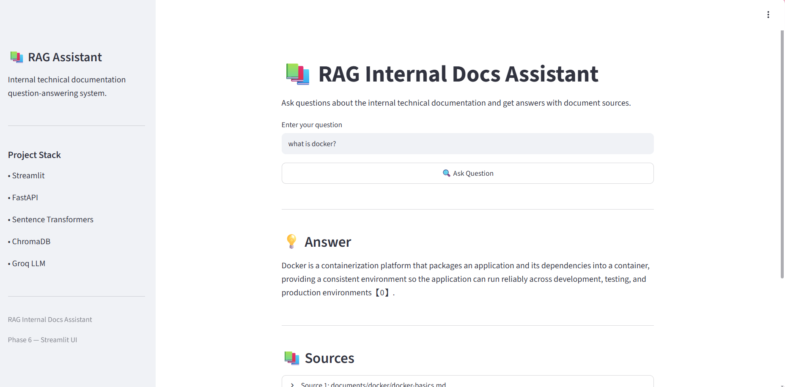
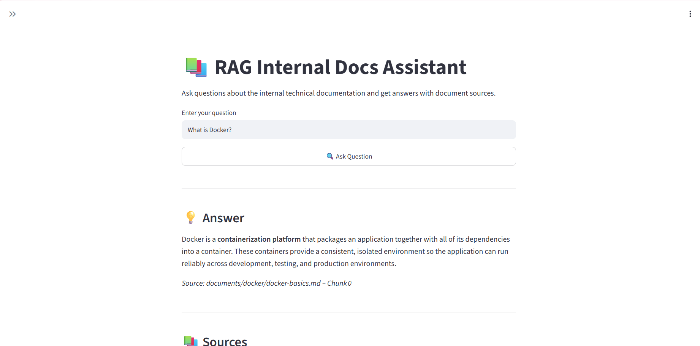

## RAG Internal Documentation Assistant 

Production-style RAG + DevOps project using FastAPI, Streamlit,
ChromaDB, Docker, GitHub Actions, GHCR, Kubernetes, Helm, NGINX
Ingress, Prometheus and Grafana.

## 1. Project Overview

An internal documentation assistant that answers questions from
technical documentation using Retrieval-Augmented Generation.

    User
    ↓
    Streamlit
    ↓
    NGINX Ingress
    ↓
    FastAPI
    ↓
    Embedding → ChromaDB → Top-K Context
    ↓
    Groq LLM
    ↓
    Answer + Sources

## 2. Technology Stack

- Area Technology

      UI Streamlit
      Backend FastAPI
      RAG sentence-transformers + ChromaDB
      LLM Groq
      Language Python
      Containers Docker
      CI/CD GitHub Actions
      Registry GHCR
      Orchestration Kubernetes (kind)
      Packaging Helm
      Ingress NGINX
      Monitoring Prometheus + Grafana

## 3. DevOps Workflow

    GitHub
      ↓
    GitHub Actions
      ├─ Tests
      ├─ Ruff
      ├─ Security/dependency checks
      └─ Docker Build
          ↓
          GHCR
          ↓
    Kubernetes + Helm
          ↓
    NGINX Ingress
          ↓
    Live Application

## 4. RAG Pipeline

    Load and clean documentation.

    Split documents into chunks.

    Generate embeddings with all-MiniLM-L6-v2.

    Store embeddings in ChromaDB.

    Embed the user question.

    Retrieve relevant top-K chunks.

    Send retrieved context to Groq.

    Return answer and source information.

    Avoid unsupported answers when documentation is insufficient.

## 5. Kubernetes Architecture

                    User
                      ↓
              NGINX Ingress
                      ↓
                Streamlit UI
                      ↓
                FastAPI
                ↙     ↘
          ChromaDB     Groq
              │
          PVC Storage

    FastAPI /metrics
          ↓
    ServiceMonitor
          ↓
    Prometheus
          ↓
    Grafana

## Implemented Kubernetes features:

    Namespace

    Deployments and Pods

    Services

    ConfigMap

    Secret

    PersistentVolumeClaim

    Startup/readiness/liveness probes

    Resource requests and limits

    NGINX Ingress

    Helm

    Prometheus ServiceMonitor

## 6. CI/CD and Security

- Implemented:

    Automated pytest

    Ruff linting

    Dependency security auditing

    Docker image build

    GHCR publishing

    API-key authentication

    Rate limiting

    Kubernetes Secrets

    Health/readiness endpoints

    Kubernetes probes

    Resource limits

    Secrets are not committed to GitHub.

## 7. Observability

- Custom Prometheus metrics:

    rag_request_count_total
    rag_request_latency_seconds
    rag_prompt_tokens_total
    rag_completion_tokens_total
    rag_total_tokens_total
    rag_error_count_total

## Grafana dashboard tracks:

    Request count/rate

    Average latency

    Token usage

    Error rate

- Verified during the project:

      Prometheus RAG target: UP (1)
      RAG requests: 3
      Total tokens: 746
      Errors: 0

## 8. Public Demo

For recruiter demonstration, the local Kubernetes application was
exposed through a Cloudflare Quick Tunnel without changing the
Kubernetes architecture.

      Public Internet
            ↓
      Cloudflare Tunnel
            ↓
      Local NGINX Ingress
            ↓
      Streamlit
            ↓
      FastAPI

- A real external question, What is Docker?, returned a successful RAG
answer.

- The Quick Tunnel URL is temporary and is intended for demonstration
rather than permanent hosting.

## 9. Screenshots

The following screenshots demonstrate the application's deployment, CI/CD pipeline, Kubernetes infrastructure, observability, and public accessibility.

### Application & Kubernetes

#### Streamlit RAG Application

Successful RAG query through the Streamlit interface, including the generated answer and source information.

#### Kubernetes Deployment

Kubernetes pods running successfully in the `rag-assistant` namespace.

#### NGINX Ingress

NGINX Ingress configuration used to route external application traffic to the Streamlit service.

### CI/CD & Observability

#### GitHub Actions

Automated CI/CD pipeline performing testing, linting, security checks, Docker image building, and GHCR publishing.

#### Grafana Dashboard

Grafana observability dashboard showing RAG request count, request rate, latency, token usage, and error metrics.

#### Prometheus Target

Prometheus successfully scraping metrics from the `rag-assistant-api` service.

### Public Demo

#### Public RAG Application

The Kubernetes-hosted RAG application accessed through a temporary Cloudflare Quick Tunnel for external demonstration and testing.

> **Note:** The Cloudflare Quick Tunnel is temporary and is used only for demonstration purposes. The application itself remains deployed on the local Kubernetes cluster.

## 10. Failure Demonstration

One useful interview story is the image-pull troubleshooting:

            Image unavailable
            ↓
            Pod/ImagePullBackOff
            ↓
            Check Pod events
            ↓
            Verify image/tag/GHCR access
            ↓
            Correct image
            ↓
            Rollout
            ↓
            Pod Running

This demonstrates real deployment troubleshooting rather than only a
successful build.